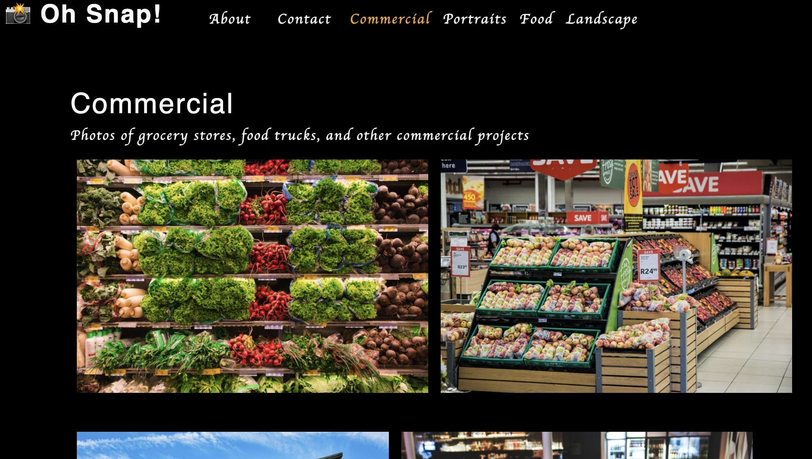

# Photo Port

## Table of Contents

- [Description](#description)
- [Education](#education)
- [Application](#application)
- [Questions](#questions)

## Description

This is a single-page application for a photography portfolio built using React following the steps of a course module.

## Education

Created the photography portfolio using React to learn the following items:

- React allows the UI to be segmented into components.
- Components are functions that are reusable.
- Hooks are used to manage state.
- JSX is a shorthand approach to create elements.
- Conditional rendering of components can create single-page applications.
- Testing in React mimics user behavior.

## Application

[Link to Deployed Application](https://gilinamcbride.github.io/photo-port/)

## Questions?

For any questions, please email gilinamcbride@gmail.com, or visit any other projects on [Github](github.com/gilinamcbride).